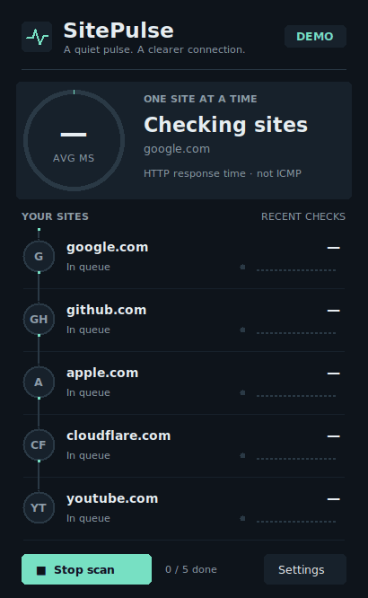
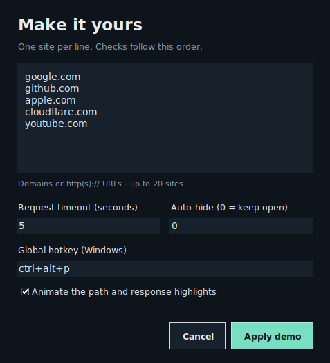

<div align="center">


# SitePulse

**Пульс ваших сайтов — прямо на рабочем столе.**

Небольшой виджет на Python/Tkinter: доступность сайтов, время HTTP-ответа и живая цепочка проверок.
Раньше проект назывался **PingCheck**; команда запуска `python pingcheck.py` сохранена.

**[Скачать для Windows](https://github.com/uclonfor/pingcheck/releases/latest/download/SitePulse.exe)** · [Все релизы](https://github.com/uclonfor/pingcheck/releases)




*На превью — демонстрационные значения, а не реальные измерения доступности сайтов.*

</div>

## Что умеет

- Проверяет сайты **строго по одному**: следующий запрос начинается только после завершения предыдущего. Само приложение не создаёт конкуренцию между своими измерениями.
- Световой импульс движется к следующему сайту, затем начинается настоящий запрос. Во время ожидания пульсирует активная строка; ответ подсвечивает её и продвигает кольцо. Время анимации не входит в измерение.
- Показывает среднее время ответа, HTTP-коды и отдельные ошибки TLS, соединения, таймаута и перенаправлений.
- Хранит в памяти историю последних 18 проверок каждого сайта. Графики имеют собственный масштаб для каждой строки.
- Перепроверяет отдельный сайт по клику и весь список по `R` или `F5`. **Stop scan** останавливает очередь после текущего запроса.
- Позволяет менять сайты, таймаут, автоскрытие и анимации прямо в **Settings**, без редактирования JSON.
- Запоминает позицию, поддерживает до 20 сайтов и прокрутку длинного списка.
- Предлагает плавное появление окна, подсветку строк и отключение анимаций.
- Работает без администратора. Глобальный хоткей доступен в Windows; в Ubuntu окно можно свернуть и вернуть через панель задач.

## Быстрый старт

Нужны **Python 3.10+**, Tk и графическая сессия.

### Ubuntu / Debian

```bash
sudo apt update
sudo apt install python3 python3-venv python3-tk
git clone https://github.com/uclonfor/pingcheck.git
cd pingcheck
python3 -m venv .venv
source .venv/bin/activate
pip install -r requirements.txt
python pingcheck.py
```

Не запускайте приложение через `sudo`: глобальный перехват клавиатуры в Linux здесь намеренно не включается. На Wayland поведение «поверх окон» и размещение зависят от оконного менеджера.

### Windows (PowerShell)

```powershell
git clone https://github.com/uclonfor/pingcheck.git
cd pingcheck
py -3 -m venv .venv
.\.venv\Scripts\python.exe -m pip install -r requirements.txt
.\.venv\Scripts\python.exe pingcheck.py
```

Готовый `SitePulse.exe` можно скачать на [странице релизов](https://github.com/uclonfor/pingcheck/releases/latest). Python для него устанавливать не нужно.

Также после успешной сборки GitHub Actions исполняемый файл доступен в **Actions → Build and tests → выбранный запуск → Artifacts → SitePulse-windows**. Распакуйте архив и запустите `SitePulse.exe`. Это артефакт CI, не подписанный установщик.

## Управление

| Действие | Управление |
| --- | --- |
| Проверить все сайты | **Check again**, `R` или `F5` |
| Проверить один сайт | Клик по строке |
| Остановить проход | **Stop scan**; текущий запрос завершится, остальные не начнутся |
| Настроить приложение | **Settings** или `Ctrl+,` после завершения прохода |
| Переместить окно | Перетаскивание заголовка или верхней области виджета |
| Скрыть / свернуть | `Esc`; автоматически после проверки |
| Показать / скрыть в Windows | `Ctrl+Alt+P`, если хоткей удалось зарегистрировать |
| Вернуть без глобального хоткея | Через панель задач |
| Завершить приложение | Крестик системного окна или `Ctrl+Q` |

Пока идёт проверка, повторные запуски игнорируются. После **Stop scan** новый проход также ждёт завершения текущего запроса — наложения измерений не будет. Автоскрытие начинается после завершения всего текущего прохода, включая анимацию. Крестик **завершает процесс**, а `Esc` скрывает окно при активном хоткее или сворачивает его в остальных случаях.

## Настройка

Откройте **Settings**, укажите сайты по одному в строке, настройте таймаут и нажмите **Save & check**. Изменения применяются сразу. Порядок строк задаёт порядок проверок; иконки существующих сайтов сохраняются. В `--demo` кнопка **Apply demo** меняет только демонстрационное окно, без записи на диск.



При первом обычном запуске создаётся `config.json`:

- из исходников — рядом с `pingcheck_core.py`;
- Windows `.exe` — `%APPDATA%\SitePulse\config.json`, вне временной папки PyInstaller;
- другая упакованная сборка — `$XDG_CONFIG_HOME/SitePulse/config.json` или `~/.config/SitePulse/config.json`.

Можно выбрать собственный файл:

```bash
python pingcheck.py --config /path/to/config.json
```

Пример — [`config.example.json`](config.example.json):

```json
{
  "hotkey": "ctrl+alt+p",
  "timeout": 5,
  "autohide_sec": 20,
  "animations": true,
  "pos": null,
  "sites": [
    {"domain": "github.com", "icon": "GH"},
    {"domain": "https://example.com/health", "icon": "EX"},
    {"domain": "http://localhost:8080", "icon": "LC"}
  ]
}
```

| Поле | Значение |
| --- | --- |
| `hotkey` | Глобальный хоткей Windows; `""` отключает его |
| `timeout` | Таймаут соединения / чтения в секундах: 0.1–120 |
| `autohide_sec` | Задержка скрытия: 0–86400 секунд; `0` отключает |
| `animations` | `false` отключает появление, пульсацию и анимацию перехода; запросы остаются последовательными |
| `pos` | `null` для автоматической позиции или `[x, y]` |
| `sites` | 1–20 объектов; `domain` обязателен, `icon` — 1–3 символа |

Отсутствующие поля берутся из настроек по умолчанию. После изменения файла перезапустите приложение. Некорректный JSON или неподходящие значения показывают понятную ошибку с путём к файлу; исходный конфиг сохраняется для исправления. Запись позиции выполняется через временный файл и атомарную замену.

## Что именно измеряется

**Это время HTTP-ответа, не ICMP ping и не проверка скорости интернета.** Таймер включает установку соединения, TLS, перенаправления и получение заголовков. Среднее учитывает все полученные HTTP-ответы, в том числе `4xx/5xx`; сетевые ошибки в среднее не входят.

Измерение начинается непосредственно перед сетевым запросом и заканчивается после получения заголовков. Пауза перехода между строками в него не входит. Последовательная очередь исключает одновременные запросы самого SitePulse, но фоновые загрузки, работа DNS/TLS и планирование потоков всё ещё могут влиять на результат. Это не инструмент для измерения микросекундной задержки.

Сначала отправляется `HEAD`. При `405` или `501` используется потоковый `GET`; тело намеренно не вычитывается. Домен без схемы получает `https://`. Ошибка HTTPS не вызывает незаметного перехода на HTTP: для HTTP-сервера явно укажите `http://`.

`2xx/3xx` считаются успешным HTTP-ответом, `4xx/5xx` — ошибкой HTTP. `403` может означать защиту от ботов, а не недоступность сайта для браузера. Успешный код также не гарантирует исправность всего сервиса.

`timeout` не является общим дедлайном всей проверки: перенаправления, DNS и запасной `GET` могут увеличить её длительность. Это следует из [семантики таймаутов Requests](https://requests.readthedocs.io/en/stable/user/quickstart/#timeouts). Ответы закрываются после чтения заголовков согласно [правилам потокового чтения Requests](https://requests.readthedocs.io/en/stable/user/advanced/#body-content-workflow).

История живёт до закрытия приложения; автоматического периодического мониторинга и уведомлений сейчас нет.

## Разработка и проверки

Сетевые проверки и конфигурация находятся в `pingcheck_core.py`; окно, последовательный планировщик и анимация — в `pingcheck.py`; редактор настроек — в `sitepulse_settings.py`. Единственный активный сетевой поток отправляет результат через очередь, а Tk обновляется главным потоком, с учётом [потоковой модели Tkinter](https://docs.python.org/3/library/tkinter.html#threading-model).

```bash
pip install -r requirements-dev.txt
ruff check .
python -m unittest discover -s tests -v
```

GUI-тесты без дисплея пропускаются. Для полного запуска на Linux:

```bash
sudo apt install xvfb xauth
xvfb-run -a python -m unittest discover -s tests -v
```

Тесты используют локальный HTTP-сервер и подменённые ответы: публичные сайты не нужны. Проверяются конфиг, атомарная запись, редиректы, запасной `GET`, ошибки TLS, отсутствие перекрытия запросов, остановка очереди, момент запуска после анимации, настройки и жизненный цикл окна. CI запускает GUI-тесты и на Linux, и на Windows.

### Посмотреть анимацию без сети

```bash
python pingcheck.py --demo
```

Режим `--demo` не читает и не записывает пользовательский конфиг, не регистрирует глобальный хоткей и показывает явно обозначенные тестовые результаты. Чтобы перезаписать PNG/GIF из настоящего интерфейса:

```bash
xvfb-run -a -s '-screen 0 1280x900x24' python scripts/capture_preview.py
```

### Собрать Windows `.exe`

На Windows, из активированного окружения:

```powershell
python -m pip install pyinstaller
python -m PyInstaller --onefile --noconsole --name SitePulse --icon assets/sitepulse.ico --add-data "assets:assets" pingcheck.py
```

Результат: `dist/SitePulse.exe`. PyInstaller нужно запускать на целевой ОС. CI сначала выполняет тесты и проверку кода, затем собирает Windows-приложение и демонстрационные изображения.

## Идеи для следующей версии

- Системный трей и платформенные горячие клавиши для Linux.
- Периодические проверки, уведомления об изменении статуса и экспорт истории.

## Лицензия

[MIT](LICENSE).
